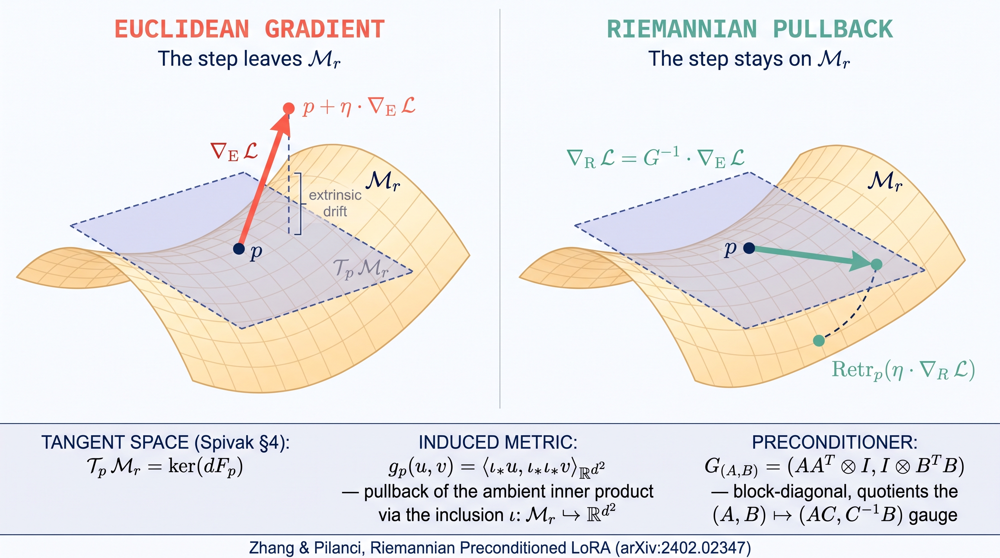
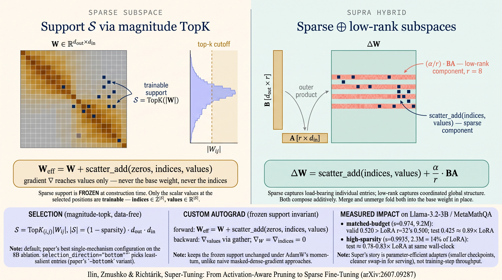
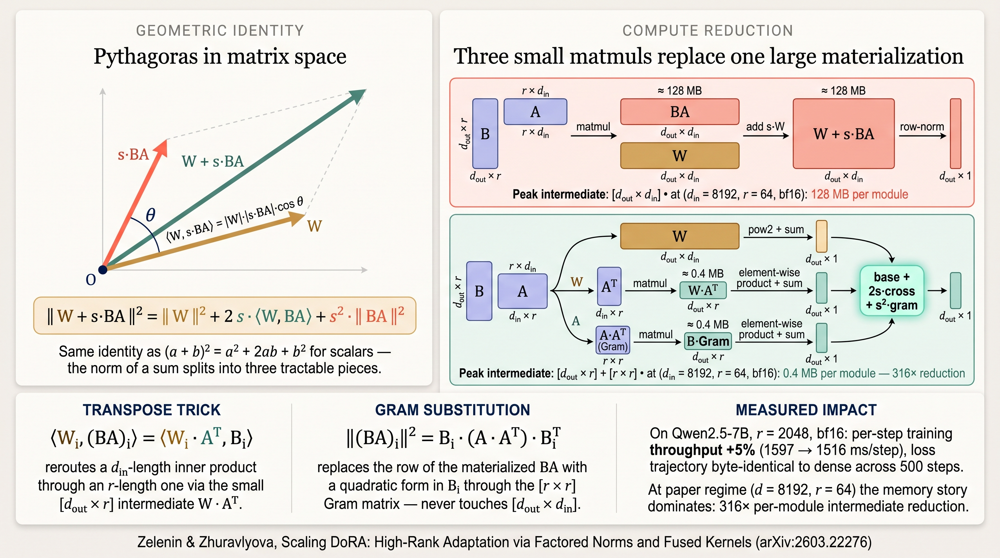

# Outrider — GitHub Action


https://github.com/user-attachments/assets/4b22a207-d878-4b4d-a1f1-02e886a8e994


**Keep the systems you maintain improving — discover, implement, and validate your next great idea, delivered as a review-ready PR.**

Outrider runs as a GitHub Action. It finds the next high-fit change, wires it into a real call site in *your* repo, and returns a draft PR whose body already carries the evidence a maintainer needs — references cited, license flagged, tests written, scope kept honest, and the implementation anchored on your repo's own merged history and conventions. **Discovery is the tool, drafting is the agent, the judgment is yours:** every run produces a branch you review, run, and decide on. Run after run, the loop compounds — **discover → implement → validate → decide** — and your repo accumulates a record of what actually fits it.

```yaml
- uses: remyxai/outrider@v1
  with:
    interest-id: ${{ vars.REMYX_INTEREST_ID }}
```

Each dispatch runs the coding agent in a fresh, ephemeral runner — candidates don't share state, testing variance stays low, and you can dispatch dozens per week without context pollution. Backends are pluggable: Anthropic Opus for the shipping commit, z.ai's GLM-5.2 at ~20× lower cost for scouting and branch-mode exploration.


## Trigger patterns

Four ways to specify what Outrider should implement — same harness downstream:

| Trigger | Where the intent comes from | How to fire |
|---|---|---|
| **Alerts** | *System-sourced.* The ranker picks from arXiv against your ResearchInterest on a weekly cron. | Scheduled — no command needed |
| **Search** | *Semi-sourced.* You supply a method-family query; the ranker returns the top arXiv hit. | `--search-method "riemannian preconditioning LoRA"` |
| **Pin** | *Reproducible.* You name an exact arXiv id. | `--pin-arxiv 2410.20305v2` |
| **Brief** | *Operator-sourced.* You write the design brief directly — an issue body, a Colab notebook, a hand-authored spec. No arXiv anchor required. | `--brief @design.md` or `--brief "add exp backoff to the HTTP client"` |

Every pattern produces the same output shape: a draft PR with implementation + tests + license section + convention-aligned body + honest scope citations. **What differs is only where the "why" comes from.**

Bring your own context — even when it's underspecified. The scaffolding fills in what the brief doesn't (references cited, license flagged, tests, convention alignment) so a two-line issue body still yields a review-ready PR.


## What you get

- **Draft PRs** wired to an existing call site, with a self-review noting what was implemented vs. left out
- **Issues** when preflight, validators, or self-review route the intent to discussion instead
- **Branch-only mode** (`publish: branch`) — pushes to the fork without opening a PR or Issue; explore N candidates before committing to any one
- **No duplicate work** — a paper isn't re-recommended once Outrider or a maintainer Issue references it
- **A selection narrative** in the step summary — why this candidate, or why nothing this run


## Model backends

| Backend | Cost / full run | Best for |
|---|---|---|
| Anthropic Opus | ~$2–3 | Finalize a draft PR |
| z.ai GLM-5.2 | ~$0.05–0.10 | Draft PR |
| Moonshot Kimi-K3 | ~$1 | Finalize a draft PR  |

Route per-dispatch via a `provider` input — see [`docs/backends.md`](docs/backends.md) for the auth-header matrix and the switching workflow template. Rule of thumb: GLM for the exploration ladder, Opus for the candidate you commit to ship.


## Quickstart

```bash
pip install remyxai
remyxai outrider init --repo owner/name --auto-interest
```

Installs the action, writes the workflow, sets the secrets (`REMYX_API_KEY`, `ANTHROPIC_API_KEY`). Scheduled cron handles the weekly cadence from there.

Trigger an ad-hoc run:

```bash
# Paper-anchored — exact arXiv id or a method-family search
remyxai outrider trigger --repo owner/name --pin-arxiv 2410.20305v2
remyxai outrider trigger --repo owner/name --search-method "riemannian preconditioning LoRA optimizer"

# Brief-anchored — a design brief you supply directly, inline or from disk
remyxai outrider trigger --repo owner/name --brief "add exponential backoff to the HTTP client"
remyxai outrider trigger --repo owner/name --brief @design.md
```

`--pin-arxiv` implements the exact paper; `--search-method` searches for the top hit; `--brief` runs the paper-less flow where the design brief you supply IS the spec. See [`remyxai-cli`](https://github.com/remyxai/remyxai-cli) for bulk-install and per-dispatch routing.

Setting up by hand instead of via the CLI? See [`docs/manual-install.md`](docs/manual-install.md).


## Examples

### Case study: three recent contributions to `huggingface/peft`

Three parameter-efficient fine-tuning methods surfaced from arXiv, drafted on the `smellslikeml/peft` fork, and shepherded upstream to `huggingface/peft`:

|  |  |  |
|---|---|---|
| **Riemannian Preconditioned LoRA** | **Super-Tuning & Supra** | **Scaling DoRA** (factored norm + fused kernel) |
| [arXiv:2402.02347](https://arxiv.org/abs/2402.02347) — Zhang & Pilanci | [arXiv:2607.09287](https://arxiv.org/abs/2607.09287) — Ilin, Zmushko & Richtárik | [arXiv:2603.22276](https://arxiv.org/abs/2603.22276) — Zelenin & Zhuravlyova |
| [huggingface/peft#3382](https://github.com/huggingface/peft/pull/3382) | [huggingface/peft#3518](https://github.com/huggingface/peft/pull/3518) | pending license clarification |
| **merged 2026-08-03** — +401/6, 32.7d review | in review — +1309/24, coord [#3450](https://github.com/huggingface/peft/issues/3450) | internal draft — [smellslikeml/peft#18](https://github.com/smellslikeml/peft/pull/18) |

Full case study — per-method deep dives, PR-shape cohort comparison, coordination-issue-first workflow — at **[docs/case-studies/peft.md](docs/case-studies/peft.md)**.

### Case study: two training-free high-resolution methods for `huggingface/diffusers`

Two complementary routes to 4K generation from off-the-shelf **FLUX** checkpoints — no fine-tuning, no new weights — surfaced from arXiv and shaped to diffusers' own conventions:

- **HRDiT** — **[huggingface/diffusers#14480](https://github.com/huggingface/diffusers/pull/14480)** (in review). NTK RoPE scaling + structure guidance for up to 4096², landed as a self-contained **community pipeline** with no core-library changes. Built minimal-first: a position-alignment port, then NTK scaling and structure guidance layered only onto the stages that needed them.
- **DyPE (+ optional spectral attention)** — proposed via **[huggingface/diffusers#14520](https://github.com/huggingface/diffusers/issues/14520)**. A training-free positional-embedding **hook** (`apply_dype`) that reproduces the reference bit-for-bit (Δ=0) and adds an optional spectral-attention mode which cuts residual 4K speckle ~6× while keeping fine detail. Offload-robust, a no-op at/below the trained resolution.

The pair puts the same problem — training-free high-res on a RoPE DiT — into two different diffusers shapes. Choosing *which* shape is itself the contribution: HRDiT self-contains as a community pipeline, while DyPE sits closer to the core hooks (`apply_faster_cache`, `apply_pyramid_attention_broadcast`). Because precedent points both ways for DyPE, that placement is raised with maintainers in #14520 rather than assumed.

Full case study — per-method detail, the placement question, validation figures — at **[docs/case-studies/diffusers.md](docs/case-studies/diffusers.md)**.
### More examples

Each PR below shows the **match** (paper → repo) and the **shape** (how the wiring landed):

- **[OLMo-core #13](https://github.com/smellslikeml/OLMo-core/pull/13)** — Preemptive training instability monitor ([arXiv:2606.28116](https://arxiv.org/abs/2606.28116)). *Match:* `train/callbacks/` has the reactive `StabilityMonitorCallback`; the preemptive variant registers alongside. *Shape:* `MechanismMonitorCallback` with QK spectral entropy + MoE routing entropy, gated by a parameter-free rolling one-sided z-score; 12 tests.
- **[OpenRLHF #14](https://github.com/smellslikeml/OpenRLHF/pull/14)** — MRPO step-level reward penalty ([arXiv:2606.31825v1](https://arxiv.org/abs/2606.31825v1)). *Match:* PPO advantages already carry per-step weighting. *Shape:* MRPO's decay factor slots into `RemoteExperienceMaker.compute_advantages_and_returns` as a second multiplier, opt-in flag, default-off byte-identical.
- **[ag2 #9](https://github.com/smellslikeml/ag2/pull/9)** — Adaptive Context Elasticizer ([arXiv:2606.31564v1](https://arxiv.org/abs/2606.31564v1)). *Match:* `MiddlewareFactory` already extends the LLM-call pipeline. *Shape:* new elastic middleware alongside `HistoryLimiter` / `TokenLimiter`, per-instance abstraction cache for reversibility.
- **[lerobot #9](https://github.com/smellslikeml/lerobot/pull/9)** — Dense Embodied Chain-of-Thought supervision ([arXiv:2606.30552v1](https://arxiv.org/abs/2606.30552v1)). *Match:* the annotator has staged language modules (plan / vqa). *Shape:* new `EcotReasoningModule` wired in as phase 4.5.
- **[sglang #3](https://github.com/smellslikeml/sglang/pull/3)** — Batch-wise Adaptive Pruning ([arXiv:2608.14003](https://arxiv.org/abs/2608.14003)). *Match:* the gated-MLP `act_fn` (`SiluAndMul`) is the scoring/pruning site; integration rides `ForwardBatch.init_new` and the decode CUDA-graph runner. *Shape:* training-free adaptive FFN pruning with the per-cycle mask delivered *under* the captured decode graph (fixed k-wide topology, between-replay buffer updates); opt-in, default-off. Outrider surfaced + drafted it; the graph-capture integration was hand-built and validated (7B: −8pp at 1.40×) and offered upstream as RFC [sgl-project/sglang#35987](https://github.com/sgl-project/sglang/issues/35987).


## Documentation

- **[Configuration reference](docs/configuration.md)** — full inputs, outputs, status codes
- **[Customization](docs/customization.md)** — tailor Outrider to your repo + signals it reads
- **[Architecture](docs/architecture.md)** — selection taxonomy, pipeline, refinement chain
- **[Guardrails](docs/guardrails.md)** — what the agent can and can't modify
- **[Security](docs/security.md)** — the agent-harness defense-in-depth model (prompt-injection & credential-leak controls)
- **[Model backends](docs/backends.md)** — full backend/auth matrix + per-dispatch switching template
- **[Environments](docs/environments.md)** — describe workflow-attached tooling via `ENVIRONMENTS.md`
- **[Weekly summary mode](docs/weekly-summary.md)** — opt-in rolling digest comments


## License

Apache 2.0. See [LICENSE](./LICENSE).
