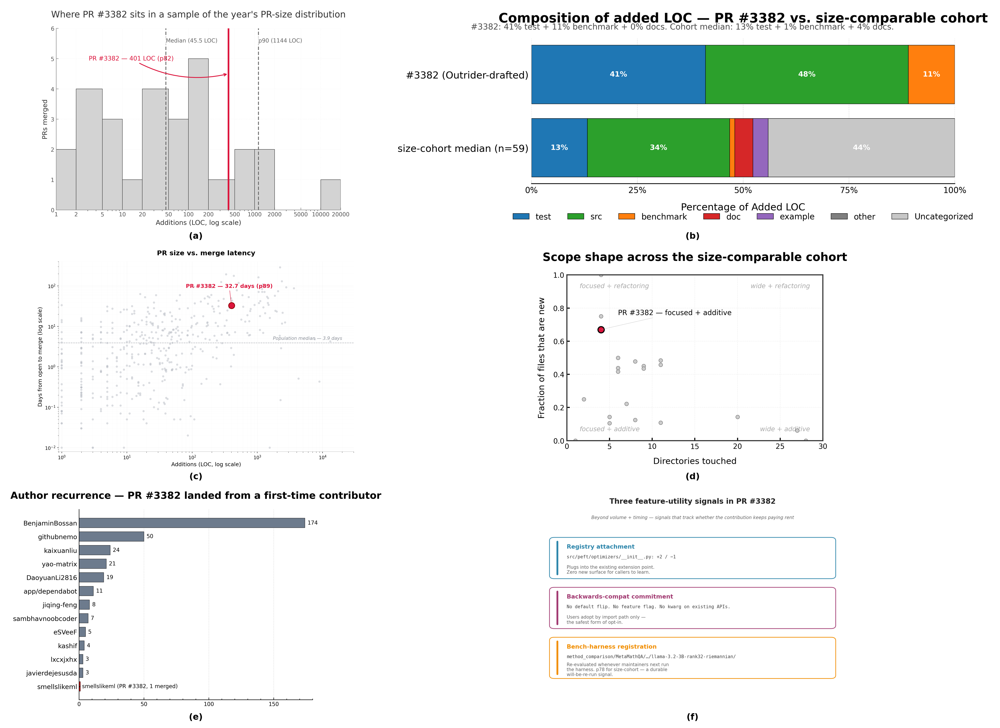

# Outrider — GitHub Action


https://github.com/user-attachments/assets/4b22a207-d878-4b4d-a1f1-02e886a8e994


Turn any brief — an arXiv paper, a search query, or your own design doc — into a review-ready draft PR. Outrider runs as a GitHub Action, wires the implementation into a real call site in your repo, and returns a PR whose body already carries the evidence a maintainer needs to review it: references cited, license flagged, tests written, honest scope discipline in the self-review, alignment with your repo's own conventions.

```yaml
- uses: remyxai/outrider@v1
  with:
    interest-id: ${{ vars.REMYX_INTEREST_ID }}
```

Each dispatch runs the coding agent in a fresh, ephemeral runner — candidates don't share state, testing variance stays low, and you can dispatch dozens per week without context pollution. Backends are pluggable: Anthropic Opus for the shipping commit, z.ai's GLM-5.2 at ~20× lower cost for scouting and branch-mode exploration.


## Trigger patterns

Four ways to specify what Outrider should implement — same harness downstream:

| Trigger | Where the intent comes from | How to fire |
|---|---|---|
| **Alerts** | *System-sourced.* The ranker picks from arXiv against your ResearchInterest on a weekly cron. | Scheduled — no command needed |
| **Search** | *Semi-sourced.* You supply a method-family query; the ranker returns the top arXiv hit. | `--search-method "riemannian preconditioning LoRA"` |
| **Pin** | *Reproducible.* You name an exact arXiv id. | `--pin-arxiv 2410.20305v2` |
| **Brief** | *Operator-sourced.* You write the design brief directly — an issue body, a Colab notebook, a hand-authored spec. No arXiv anchor required. | `--brief @design.md` or `--brief "add exp backoff to the HTTP client"` |

Every pattern produces the same output shape: a draft PR with implementation + tests + license section + convention-aligned body + honest scope citations. **What differs is only where the "why" comes from.**

Bring your own context — even when it's underspecified. The scaffolding fills in what the brief doesn't (references cited, license flagged, tests, convention alignment) so a two-line issue body still yields a review-ready PR.


## What you get

- **Draft PRs** wired to an existing call site, with a self-review noting what was implemented vs. left out
- **Issues** when preflight, validators, or self-review route the intent to discussion instead
- **Branch-only mode** (`publish: branch`) — pushes to the fork without opening a PR or Issue; explore N candidates before committing to any one
- **No duplicate work** — a paper isn't re-recommended once Outrider or a maintainer Issue references it
- **A selection narrative** in the step summary — why this candidate, or why nothing this run


## Model backends

| Backend | Cost / full run | Best for |
|---|---|---|
| Anthropic Opus | ~$2–3 | Finalize a draft PR |
| z.ai GLM-5.2 | ~$0.05–0.10 | Draft PR |
| Moonshot Kimi-K3 | ~$1 | Finalize a draft PR  |

Route per-dispatch via a `provider` input — see [`docs/backends.md`](docs/backends.md) for the auth-header matrix and the switching workflow template. Rule of thumb: GLM for the exploration ladder, Opus for the candidate you commit to ship.


## Quickstart

```bash
pip install remyxai
remyxai outrider init --repo owner/name --auto-interest
```

Installs the action, writes the workflow, sets the secrets (`REMYX_API_KEY`, `ANTHROPIC_API_KEY`). Scheduled cron handles the weekly cadence from there.

Trigger an ad-hoc run:

```bash
# Paper-anchored — exact arXiv id or a method-family search
remyxai outrider trigger --repo owner/name --pin-arxiv 2410.20305v2
remyxai outrider trigger --repo owner/name --search-method "riemannian preconditioning LoRA optimizer"

# Brief-anchored — a design brief you supply directly, inline or from disk
remyxai outrider trigger --repo owner/name --brief "add exponential backoff to the HTTP client"
remyxai outrider trigger --repo owner/name --brief @design.md
```

`--pin-arxiv` implements the exact paper; `--search-method` searches for the top hit; `--brief` runs the paper-less flow where the design brief you supply IS the spec. See [`remyxai-cli`](https://github.com/remyxai/remyxai-cli) for bulk-install and per-dispatch routing.

Setting up by hand instead of via the CLI? See [`docs/manual-install.md`](docs/manual-install.md).


## Examples

### Case study: three-part contribution to `huggingface/peft`

Three parameter-efficient fine-tuning methods surfaced from arXiv, drafted on the `smellslikeml/peft` fork, and shepherded upstream to `huggingface/peft`:

| Method | Paper | Upstream PR | +LOC / Files | Status |
|---|---|---|---:|---|
| Riemannian Preconditioned LoRA | [arXiv:2402.02347](https://arxiv.org/abs/2402.02347) (Zhang & Pilanci) | [huggingface/peft#3382](https://github.com/huggingface/peft/pull/3382) | +401 / 6 | **merged 2026-08-03** — 32.7d review |
| Super-Tuning & Supra | [arXiv:2607.09287](https://arxiv.org/abs/2607.09287) (Ilin, Zmushko & Richtárik) | [huggingface/peft#3518](https://github.com/huggingface/peft/pull/3518) | +1309 / 24 | in review — coord [#3450](https://github.com/huggingface/peft/issues/3450) |
| Scaling DoRA (factored norm + fused Triton kernel) | [arXiv:2603.22276](https://arxiv.org/abs/2603.22276) (Zelenin & Zhuravlyova) | pending license clarification | — | internal draft ([smellslikeml/peft#18](https://github.com/smellslikeml/peft/pull/18)) |



Composite analytics for the merged Riemannian LoRA PR (six panels): size in cohort context, composition split, review latency, scope shape, contributor recurrence, and feature-utility signals. Full case study — per-method deep dives, cohort PR-shape comparison, coordination-issue-first workflow — at **[docs/case-studies/peft.md](docs/case-studies/peft.md)**.

### More examples

Each PR below shows the **match** (what in the paper mapped to what in the repo) and the **shape** (how the wiring landed):

- **[OLMo-core #13](https://github.com/smellslikeml/OLMo-core/pull/13)** — Mechanism-driven preemptive instability monitor ([arXiv:2606.28116](https://arxiv.org/abs/2606.28116)). *Match:* `train/callbacks/` already has the reactive `StabilityMonitorCallback` shape; the preemptive variant registers alongside as a forward-hook + `record_metric` peer that fires thousands of steps before the loss diverges. *Shape:* `MechanismMonitorCallback` with QK spectral entropy + MoE routing entropy signals gated by a parameter-free rolling-window one-sided z-score detector; 12 tests covering GQA, layer/token sub-sampling, hook lifecycle, and state-dict window truncation. 
- **[OpenRLHF #14](https://github.com/smellslikeml/OpenRLHF/pull/14)** — MRPO step-level reward penalty ([arXiv:2606.31825v1](https://arxiv.org/abs/2606.31825v1)). *Match:* PPO advantages already carry per-step weighting; MRPO's decay factor slots in as a second multiplier. *Shape:* new hook wired into `RemoteExperienceMaker.compute_advantages_and_returns`, opt-in flag, default-off byte-identical. PR body names the sibling papers in the same PPO cluster as follow-ups.
- **[ag2 #9](https://github.com/smellslikeml/ag2/pull/9)** — Adaptive Context Elasticizer ([arXiv:2606.31564v1](https://arxiv.org/abs/2606.31564v1)). *Match:* `MiddlewareFactory` already extends the LLM-call pipeline; a new elastic middleware sits alongside `HistoryLimiter` / `TokenLimiter`. *Shape:* per-instance abstraction cache for reversibility, deterministic extractive digest keeps the middleware dependency-free.
- **[lerobot #9](https://github.com/smellslikeml/lerobot/pull/9)** — Dense Embodied Chain-of-Thought supervision ([arXiv:2606.30552v1](https://arxiv.org/abs/2606.30552v1)). *Match:* the annotator has staged language modules (plan / vqa); ECoT slots in as another stage with the same I/O contract. *Shape:* new `EcotReasoningModule`, wired into the executor as phase 4.5.
- **[atropos #16](https://github.com/smellslikeml/atropos/pull/16)** — Deterministic reward floor for reward-hacking mitigation ([arXiv:2606.27291v1](https://arxiv.org/abs/2606.27291v1)). *Match:* atropos exposes `RewardFunction` + `@registry.register` at `atroposlib/envs/reward_fns/`, the canonical extension point for reward-shape contributions in the RL environment framework. *Shape:* new `RewardFloor(RewardFunction)` with the paper's two rules (6-gram verbatim overlap + date-range lifted) — no invented detectors, uniform `-1.0` hard cap default, 28 tests covering rule triggers + registry integration + composition edge cases; docstring documents the grader-skip deviation (paper's other action doesn't map cleanly onto atropos's scalar reward contract).


## Documentation

- **[Configuration reference](docs/configuration.md)** — full inputs, outputs, status codes
- **[Customization](docs/customization.md)** — tailor Outrider to your repo + signals it reads
- **[Architecture](docs/architecture.md)** — selection taxonomy, pipeline, refinement chain
- **[Guardrails](docs/guardrails.md)** — what the agent can and can't modify
- **[Model backends](docs/backends.md)** — full backend/auth matrix + per-dispatch switching template
- **[Environments](docs/environments.md)** — describe workflow-attached tooling via `ENVIRONMENTS.md`
- **[Weekly summary mode](docs/weekly-summary.md)** — opt-in rolling digest comments


## License

Apache 2.0. See [LICENSE](./LICENSE).
