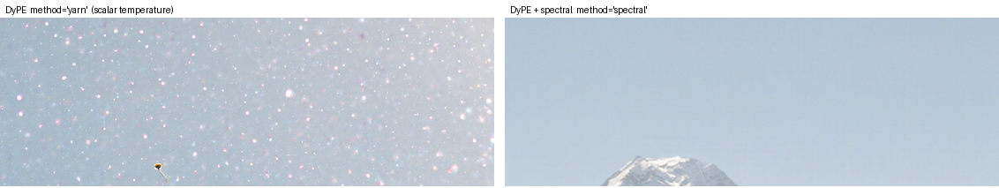

# Case study — two training-free high-resolution methods for `huggingface/diffusers`

Two complementary routes to 4K generation from off-the-shelf **FLUX** checkpoints — no fine-tuning, no new weights — surfaced from arXiv, prototyped on the [`smellslikeml/diffusers`](https://github.com/smellslikeml/diffusers) fork, and taken toward `huggingface/diffusers`. The pair puts the same problem — training-free high-resolution on a RoPE DiT — into two different library shapes, and the choice of shape is itself the contribution.

---

## 1. HRDiT — community pipeline (in review)

**Paper**: HRDiT — *Training-free high-resolution generation* ([arXiv:2608.07003](https://arxiv.org/abs/2608.07003)), ref repo [zylwithxy/HRDiT](https://github.com/zylwithxy/HRDiT) (MIT)
**Upstream PR**: [`huggingface/diffusers#14480`](https://github.com/huggingface/diffusers/pull/14480) — in review
**Fork branch**: [`flux-hrdit-community-pipeline`](https://github.com/smellslikeml/diffusers/tree/flux-hrdit-community-pipeline)

4K (up to 4096²) from off-the-shelf FLUX.1-dev — no fine-tuning — via NTK-aware RoPE scaling, monotonic bundle coarsening (SPA), and a structure-guided progressive ladder. Users get 4K straight from the base checkpoint instead of the generate-then-upscale or train-a-high-res-model workarounds.

Landed as a **self-contained community pipeline** (`examples/community/pipeline_flux_hrdit.py`) with no core-library changes. Built minimal-first: a position-alignment port established parity, then NTK RoPE scaling and structure guidance were layered onto only the stages that needed them (the speed-oriented HAP / DWT stages were documented and deferred, not shipped).

---

## 2. DyPE (+ optional spectral attention) — hook (proposed)

**Papers**: DyPE — *Dynamic Position Extrapolation* ([arXiv:2510.20766](https://arxiv.org/abs/2510.20766)); SEGA — *Spectral-Energy Guided Attention* ([arXiv:2605.22668](https://arxiv.org/abs/2605.22668))
**Upstream issue**: [`huggingface/diffusers#14520`](https://github.com/huggingface/diffusers/issues/14520) — placement proposal
**Reference branch**: [`dype-upstream-0.40`](https://github.com/smellslikeml/diffusers/tree/dype-upstream-0.40) — rebased on current `main`, 24 hook tests passing

`apply_dype(pipe.transformer)` swaps the transformer's rotary embedding for a timestep-aware YaRN / NTK-by-parts schedule (`method="yarn"`), a no-op at/below the trained resolution. `method="spectral"` adds a per-frequency, content-aware attention temperature computed from the latent's spectral energy at each denoising step.

Validated on FLUX.1-Krea-dev at 4096²:

- `method="yarn"` reproduces the reference implementation ([guyyariv/DyPE](https://github.com/guyyariv/DyPE), MIT) **bit-for-bit** (Δ=0 on the positional-embedding output).
- `method="spectral"` cuts flat-sky high-frequency speckle **~6×** (Laplacian variance 76.5 → 12.7) while keeping fine detail — the separation a single scalar attention temperature can't achieve.

State (the timestep, and for `spectral` the latent's spectral profiles) is fed through a native `register_forward_pre_hook`, so it survives `enable_model_cpu_offload`. The spectral mode implements SEGA but is exposed as `method="spectral"` to avoid colliding with the existing Semantic-Guidance "SEGA" in diffusers.

---

## Calibrated shape — the real contribution

HRDiT self-contains cleanly as a community pipeline. DyPE, by contrast, modifies a model internal (the positional embedding) at inference — the same surface as diffusers' core hooks (`apply_faster_cache`, `apply_pyramid_attention_broadcast`). But training-free high-resolution methods have also historically landed as community pipelines (DemoFusion). Precedent points both ways, so the placement is raised with the maintainers in [#14520](https://github.com/huggingface/diffusers/issues/14520) **before** opening the PR rather than assumed.

A pipeline-level caveat surfaced during validation: above ~2K, FLUX's default flow-matching shift (`mu`) grows with sequence length and collapses the sigma schedule — so both methods pin `base_shift == max_shift`. It's documented as a usage step, since a positional-embedding hook can't reach the pipeline's scheduler.

## Outrider's role

Both methods were surfaced from arXiv and drafted on the fork by Outrider — DyPE via a brief-anchored run. The draft is the *start*: parity checking, the spectral port, the shift and offload fixes, the rebase onto current `main`, and the maintainer-facing framing were the substantial follow-on. What Outrider removes is the cold-start — turning "this paper looks relevant" into a wired, testable branch to harden.

## References

- HRDiT — [arXiv:2608.07003](https://arxiv.org/abs/2608.07003) · [huggingface/diffusers#14480](https://github.com/huggingface/diffusers/pull/14480)
- DyPE — [arXiv:2510.20766](https://arxiv.org/abs/2510.20766) · [guyyariv/DyPE](https://github.com/guyyariv/DyPE) (MIT)
- SEGA — [arXiv:2605.22668](https://arxiv.org/abs/2605.22668) · [wildminder/ComfyUI-DyPE](https://github.com/wildminder/ComfyUI-DyPE) (Apache-2.0)
- Placement proposal — [huggingface/diffusers#14520](https://github.com/huggingface/diffusers/issues/14520)
